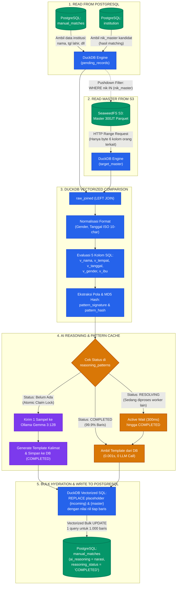
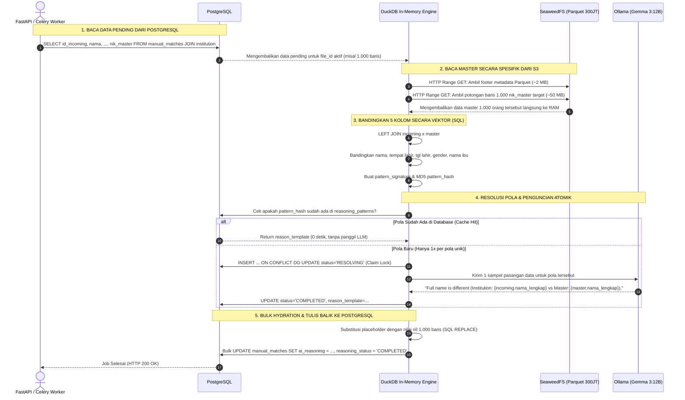

# Panduan Arsitektur End-to-End AI Reasoning Pipeline

Dokumen ini menjelaskan alur kerja lengkap (*end-to-end*) dari modul **AI Reasoning Synchrono**, mulai dari membaca data anomali di PostgreSQL, menarik data pembanding dari Master Parquet di S3, membandingkan atribut demografi secara vektor, menghasilkan narasi review menggunakan AI lokal (Gemma 3:12B), hingga menuliskan kembali hasil akhirnya ke PostgreSQL.

---

## 1. Diagram Arsitektur End-to-End



---

## 2. Diagram Alur Interaksi Komponen (Sequence Diagram)

Diagram berikut memperlihatkan urutan komunikasi antar-service dari saat job di-trigger hingga hasil narasi tersimpan:



---

## 3. Penjelasan 5 Tahap Pipeline Secara Mendalam

### Tahap 1: Ekstraksi Data Pending dari PostgreSQL
* **Tujuan:** Mengisolasi record institusi yang masuk kategori manual review (Grade B / C) untuk file batch tertentu.
* **Proses:**
  DuckDB membaca tabel `manual_matches` yang berstatus `PENDING` atau `FAILED` dan menggabungkannya (*JOIN*) dengan tabel `institution` untuk memperoleh kolom `nik_master`.
* **Karakteristik Kunci:**
  Kolom `nik_master` adalah NIK kandidat kependudukan yang **sudah ditemukan pada tahap matching sebelumnya**. Reasoning tidak mencari siapa orangnya, melainkan meminjam NIK kandidat tersebut untuk ditarik detailnya dari master.

---

### Tahap 2: Two-Phase Semi-Join Pushdown ke Parquet Master S3
* **Tujuan:** Mengambil data pembanding 1.000 orang dari master kependudukan (300 juta baris / 300 GB) tanpa mengunduh seluruh file.
* **Proses:**
  DuckDB mengeksekusi query semi-join:
  ```sql
  SELECT LPAD(TRIM(CAST(nik AS VARCHAR)), 16, '0') AS nik_master,
         nama_lengkap, tempat_lahir,
         SUBSTRING(TRIM(COALESCE(CAST(tanggal_lahir AS VARCHAR), '')), 1, 10) AS tanggal_lahir_master,
         jenis_kelamin, nama_ibu
  FROM read_parquet('s3://master-kependudukan/master.parquet')
  WHERE nik IN (SELECT DISTINCT nik_master FROM pending_records WHERE nik_master IS NOT NULL)
  QUALIFY ROW_NUMBER() OVER (PARTITION BY LPAD(TRIM(CAST(nik AS VARCHAR)), 16, '0')) = 1
  ```
* **Mekanisme Efisiensi:**
  1. *Projection Pushdown:* Dari puluhan kolom kependudukan di S3, DuckDB hanya meminta 6 kolom yang relevan.
  2. *Row-Group Pruning:* Berdasarkan batas min/max NIK pada metadata Parquet, DuckDB hanya meminta byte dari blok yang memuat NIK target.
  3. *HTTP Range Request:* Data yang ditransfer dari S3 ke RAM DuckDB hanya berkisar **50 MB hingga 100 MB** (bukan 300 GB).

---

### Tahap 3: Perbandingan Vektor 5 Kolom & Hashing Pola (DuckDB)
* **Tujuan:** Menentukan status diskrepansi tiap baris secara serentak di dalam memori.
* **Proses:**
  DuckDB mengevaluasi 5 atribut demografi:
  - `nama_lengkap` -> `SAME`, `DIFFERENT`, `EMPTY_IN_INSTITUTION`, `EMPTY_IN_MASTER`
  - `tempat_lahir` -> `SAME`, `DIFFERENT`, `EMPTY_IN_INSTITUTION`, `EMPTY_IN_MASTER`
  - `tanggal_lahir` -> `SAME`, `DIFFERENT`, `EMPTY_IN_INSTITUTION`, `EMPTY_IN_MASTER`
  - `jenis_kelamin` -> `SAME`, `DIFFERENT`, `EMPTY_IN_INSTITUTION`, `EMPTY_IN_MASTER`
  - `nama_ibu` -> `SAME`, `DIFFERENT`, `EMPTY_IN_INSTITUTION`, `EMPTY_IN_MASTER`
* **Hasil:**
  Setiap baris menghasilkan string gabungan (*pattern signature*) dan kode hash MD5 unik (*pattern hash*):
  ```text
  Signature: jenis_kelamin:SAME|nama_ibu:SAME|nama_lengkap:DIFFERENT|tanggal_lahir:SAME|tempat_lahir:SAME
  Hash     : 23be7a4d637d0ec5614ae1fdd124705f
  ```

---

### Tahap 4: Resolusi Pola & Pemanggilan AI (Idempotent Pattern Lock)
* **Tujuan:** Menghasilkan narasi penjelasan tanpa pemborosan komputasi LLM.
* **Proses:**
  1. *Pemeriksaan Cache:* Sistem mengecek apakah `pattern_hash` sudah ada di tabel `reasoning_patterns` dengan status `COMPLETED`.
  2. *Cache Hit (99.9% kasus):* Mengambil template yang sudah tersimpan seketika (0.001 detik).
  3. *Pola Baru (Cold Pattern):* Worker melakukan *atomic lock claim*:
     ```sql
     INSERT INTO reasoning_patterns (...) VALUES (..., 'RESOLVING')
     ON CONFLICT DO UPDATE ... RETURNING status, locked_by;
     ```
     Worker pemenang mengirim **1 sampel data** ke model lokal **Gemma 3:12B** (Ollama) untuk membuat kalimat template generik ber-placeholder. Setelah selesai, status diubah menjadi `COMPLETED`.
  4. *Anti-Thundering Herd:* Worker lain yang memproses pola yang sama secara bersamaan akan menunggu (*active await* tiap 300ms) dan langsung memakai template yang sudah selesai tanpa memanggil LLM ulang.

---

### Tahap 5: Bulk SQL Hydration & Penulisan Balik ke PostgreSQL
* **Tujuan:** Mengisi placeholder template dengan data aktual dan menyimpannya secara massal ke database.
* **Proses:**
  Alih-alih melakukan manipulasi teks satu per satu di Python, DuckDB melakukan substitusi string massal langsung di memori menggunakan fungsi `REPLACE()` bersarang:
  ```sql
  REPLACE(
    REPLACE(rp.reason_template, '{incoming.nama_lengkap}', rv.nama_incoming),
    '{master.nama_lengkap}', rv.nama_master
  )
  ```
* **Penyimpanan:**
  Hasil akhir di-update ke tabel `manual_matches` di PostgreSQL dalam **1 query UPDATE terpadu**:
  ```sql
  UPDATE pg.public.manual_matches mm
  SET ai_reasoning = f.ai_reasoning,
      reasoning_status = 'COMPLETED',
      reasoning_source = f.reasoning_source,
      reasoning_pattern = f.pattern_name,
      updated_at = NOW()
  FROM filled_reasons f
  WHERE mm.file_id = f.file_id AND mm.id_incoming = f.id_incoming;
  ```

---

## 4. Simulasi Nyata Transformasi Data (Record Lifecycle)

Berikut adalah perjalanan satu record dari status mentah hingga selesai di-review:

```text
1. DATA INPUT DI POSTGRESQL (manual_matches & institution)
   id_incoming            : inc_0042
   nik_incoming           : 3201018504120002
   nik_master (kandidat)  : 3201018504120002
   nama_incoming          : AHMAD SUBARJO
   tempat_lahir_incoming  : BANDUNG
   tanggal_lahir_incoming : 1985-04-12
   nama_ibu_incoming      : SITI AMINAH

2. DATA PEMBANDING DIAMBIL DARI S3 (target_master)
   nama_master            : ACHMAD SUBARJO
   tempat_lahir_master    : BANDUNG
   tanggal_lahir_master   : 1985-04-12
   nama_ibu_master        : SITI AMINAH

3. HASIL EVALUASI DUCKDB
   v_nama          : DIFFERENT (Ahmad vs Achmad)
   v_tempat_lahir  : SAME
   v_tanggal_lahir : SAME
   v_jenis_kelamin : SAME
   v_nama_ibu      : SAME
   pattern_hash    : 23be7a4d637d0ec5614ae1fdd124705f

4. TEMPLATE DARI AI / CACHE
   "Full name is different (Institution: {incoming.nama_lengkap} vs Master: {master.nama_lengkap})."

5. HASIL BULK HYDRATION & TERSIMPAN DI POSTGRESQL
   ai_reasoning     : "Full name is different (Institution: AHMAD SUBARJO vs Master: ACHMAD SUBARJO)."
   reasoning_status : COMPLETED
   reasoning_source : CACHE
```

---

## 5. Ringkasan Keunggulan Kinerja

| Metrik | Nilai Aktual | Keterangan |
| :--- | :---: | :--- |
| **Konsumsi RAM DuckDB** | **1.0 - 1.8 GB** | Stabil dan tidak terpengaruh oleh besarnya file master 300 GB di S3 (Zero-OOM). |
| **Beban Panggilan LLM** | **~3 - 5 kali / batch** | 99.9% baris terhidrasi dari cache template tanpa inferensi LLM. |
| **Kecepatan Komparasi SQL** | **< 0.5 detik / 1.000 baris** | Evaluasi 5 kolom berjalan secara vektor di RAM. |
| **Throughput Penulisan DB** | **~0.1 detik / 1.000 baris** | Memanfaatkan bulk update berbasis temporary table di PostgreSQL. |
