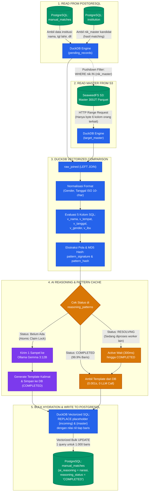
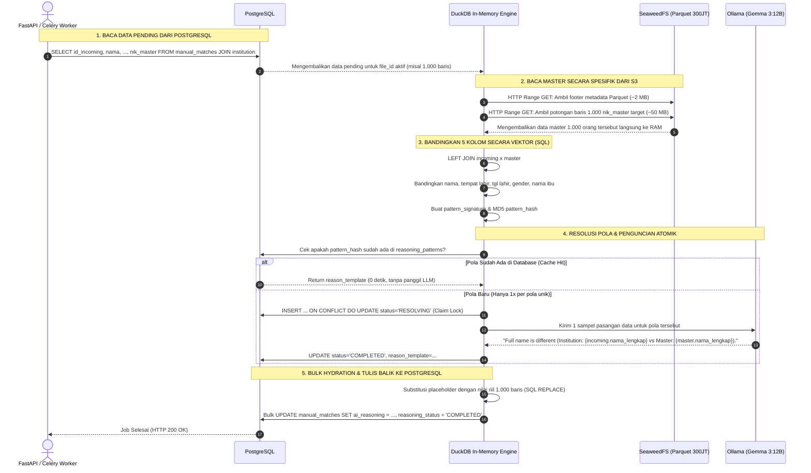

# Synchrono AI Reasoning Engine — Architecture & Technical Specification

> **Dokumen Spesifikasi Arsitektur Sistem (Enterprise Architecture / Engineering Spec)**  
> **Status:** Production-Ready / Active  
> **Versi:** 2.0.0  
> **Target Mesin:** Python 3.12+, DuckDB 1.1+, FastAPI, Ollama (Gemma 3:12B), PostgreSQL 15+  
> **Ruang Lingkup:** Standalone Microservice & Embeddable Package (`reasoning/`)

---

## 1. Executive Summary & Problem Statement

### 1.1 Latar Belakang Bisnis
Pada proses rekonsiliasi data kependudukan skala nasional (Dukcapil) di Synchrono, pencocokan data diklasifikasikan ke dalam tiga kategori utama:
1. `AUTO_MATCH`: Data identik 100% (NIK atau kombinasi nama, tgl lahir, ibu kandung sama persis).
2. `AUTO_UNMATCH`: Data tidak ditemukan sama sekali di master data kependudukan.
3. `MANUAL_REVIEW`: Data memiliki kemiripan tinggi namun terdapat perbedaan minor (misalnya kesalahan ketik pada nama, format tanggal lahir terbalik, atau nama ibu disingkat).

Baris data yang masuk kategori `MANUAL_REVIEW` (Grade B / Grade 4) harus diverifikasi oleh tim verifikator manusia. Tanpa penjelasan, verifikator harus membandingkan kolom demi kolom secara manual, yang memakan waktu ~45-90 detik per baris.

### 1.2 Masalah Rekayasa & Bottleneck Solusi Konvensional
Menggunakan Large Language Model (LLM) secara naif untuk menghasilkan narasi penjelasan per baris menghadirkan tiga masalah fatal:
1. **Ledakan Biaya & Latensi ($O(N)$ Complexity):** Pada batch 100.000 baris manual review, pemanggilan LLM baris-per-baris dengan latensi 1.5 detik per inferensi membutuhkan waktu **41,6 jam** dan beban komputasi masif.
2. **Keterbatasan Memori (OOM pada 100 Juta Baris):** Menarik master data kependudukan (100.000.000+ baris) ke dalam memori aplikasi Python (Pandas/Polars) akan menghabiskan RAM > 120 GB dan menyebabkan *Out of Memory* (OOM).
3. **Halusinasi & Ketidakkonsistenan:** LLM generatif bebas cenderung menghasilkan narasi yang tidak seragam, menyebutkan nama yang salah, atau bahkan mengarang selisih yang tidak ada.

### 1.3 Solusi: Synchrono Hybrid AI Reasoning
Synchrono AI Reasoning memecahkan ketiga masalah tersebut melalui pendekatan arsitektur hibrida:
- **Zero-OOM Two-Phase Semi-Join Pushdown:** Menggunakan DuckDB untuk melakukan proyeksi dan filter langsung ke file Parquet master 100 juta baris di S3/SeaweedFS (atau PostgreSQL) tanpa memuat seluruh data ke memori (< 200 MB RAM footprint).
- **Pattern Caching & Signature Hashing:** Mengelompokkan jutaan baris review ke dalam *signature pola selisih unik* ($O(K)$ complexity di mana $K \ll N$). LLM hanya dipanggil **1 kali per pola baru** untuk menghasilkan template berparameter; baris sisanya dihidrasi secara instan via SQL vectorized string replacement.
- **FastAPI Standalone & Embeddable ("Dapat Dijahit"):** Tidak bergantung pada kanvas visual Langflow. Dapat dijalankan mandiri sebagai REST API microservice atau di-mount ke backend FastAPI yang sudah ada hanya dengan 2 baris kode.

---

## 2. High-Level Architecture & End-to-End Dataflow

### 2.1 Diagram Arsitektur Pipeline End-to-End

Berikut adalah alur lengkap pemrosesan data anomali manual review dari pembacaan PostgreSQL hingga penyimpanan narasi akhir:



---

### 2.2 Arsitektur Komponen Event-Driven (Celery & Redis)

```
                  ┌──────────────────────────────────────────────┐
                  │          Klien / Backend Synchrono           │
                  └───────────────┬──────────────────────────────┘
                                  │
                 HTTP REST API    │  (atau Direct Function Call)
                                  ▼
       ┌──────────────────────────────────────────────────────────────┐
       │               FastAPI Layer (`reasoning.router`)             │
       │   - POST /v1/reasoning/trigger/{file_id:path}                │
       │   - POST /v1/reasoning/dispatch                              │
       │   - GET  /v1/reasoning/status/{file_id:path}                 │
       │   - POST /v1/reasoning/clear-cache                           │
       └──────────────────────┬───────────────────────▲───────────────┘
                              │                       │
                        Enqueues Job             Polls Status
                              ▼                       │
       ┌──────────────────────────────────────────────┴───────────────┐
       │                 Message Broker (Redis Queue)                 │
       │   - Distributed Task Queue (`reasoning_queue`)               │
       │   - Prefetch Multiplier = 1 & Late Acks                      │
       └──────────────────────┬───────────────────────────────────────┘
                              │
                      Worker Dequeue
                              ▼
       ┌──────────────────────────────────────────────────────────────┐
       │               Celery Worker Pool (`reasoning.tasks`)         │
       │   - Concurrency N Worker                                     │
       │   - Automatic Failover ke In-Process Thread jika Redis mati  │
       └──────────────────────┬───────────────────────────────────────┘
                              │
                              ▼
       ┌──────────────────────────────────────────────────────────────┐
       │          Core Engine (`reasoning.core.execute_reasoning`)    │
       │                                                              │
       │  [Tahap 1] Ambil review kandidat dari `manual_matches` &     │
       │            `institution` di PostgreSQL                       │
       │  [Tahap 2] Two-Phase Semi-Join ke Parquet 300M / S3          │
       │  [Tahap 3] Ekstraksi Vektor Perbedaan (5 Kolom Utama)        │
       │  [Tahap 4] Pattern Signature Hashing (MD5)                   │
       │  [Tahap 5] Distributed Pattern Lock (`reasoning_patterns`)   │
       │            ├── HIT  ─► Pakai template yang sudah ada         │
       │            ├── WAIT ─► Active Await (300ms) jika 'RESOLVING' │
       │            └── MISS ─► Claim 'RESOLVING' & Panggil Gemma 3   │
       │  [Tahap 6] Vectorized SQL Batch Hydration & Template Replace │
       │  [Tahap 7] Vectorized Bulk UPDATE ke `manual_matches`        │
       └──────────────────────────────────────────────────────────────┘
```

---

### 2.3 Sequence Diagram Alur End-to-End Terpadu

Diagram berikut memperlihatkan urutan komunikasi antar-service dari saat job di-trigger hingga hasil narasi tersimpan:



---

## 3. Core Engineering Innovations & Technical Deep-Dive

### 3.1 Zero-OOM Two-Phase Semi-Join Pushdown (100 Juta Baris Master)
Salah satu keunggulan arsitektural utama sistem ini adalah kemampuan menyandingkan ribuan baris `manual_matches` dengan master data kependudukan berukuran **100 juta baris (Parquet di S3/SeaweedFS)** tanpa pernah mengalami OOM.

#### Mekanisme Eksekusi:
1. **Phase 1 — Incoming Isolation:** DuckDB membuat view `review_keys` yang hanya berisi NIK dari baris manual review file terkait:
   ```sql
   CREATE TEMPORARY VIEW review_keys AS
   SELECT DISTINCT id_incoming, nik_master
   FROM pg.public.manual_matches
   WHERE file_id = 'test_grade_b_gemma';
   ```
2. **Phase 2 — Predicate & Column Pushdown:** DuckDB membaca Parquet master di SeaweedFS (`s3://syncrono-master/master-data/uji-master-100juta.parquet`):
   - **Column Projection Pushdown:** Hanya 5 kolom yang dibaca (`nik`, `nama_lengkap`, `tempat_lahir`, `tanggal_lahir`, `nama_ibu`). Kolom lain diabaikan secara fisik di storage layer.
   - **Filter & Semi-Join Pushdown:** DuckDB memanfaatkan Parquet Row-Group Statistics (min/max metadata index) untuk melompati ratusan juta baris yang NIK-nya tidak ada dalam `review_keys`.
   ```sql
   CREATE TEMPORARY VIEW joined_candidates AS
   SELECT 
       r.id_incoming,
       r.nama_incoming,
       m.nama_lengkap AS nama_master,
       r.tempat_lahir_incoming,
       m.tempat_lahir AS tempat_lahir_master,
       r.tanggal_lahir_incoming,
       m.tanggal_lahir AS tanggal_lahir_master,
       r.nama_ibu_incoming,
       m.nama_ibu AS nama_ibu_master
   FROM review_keys r
   JOIN read_parquet('s3://syncrono-master/.../uji-master-100juta.parquet') m
     ON r.nik_master = m.nik;
   ```
3. **Efisiensi Memori:** Penggunaan RAM konstan di bawah **200 MB**, terlepas dari apakah data master berisi 1 juta atau 100 juta baris.

---

### 3.2 Pattern Signature Hashing & Anti-Double-Hit Cache

#### Formulasi Signature Pola
Daripada memproses teks mentah yang bervariasi secara combinatorial, engine menghitung vektor selisih diskrit (*difference vector*) untuk setiap pasangan data:
- `diff_nama`: 0 (sama persis), 1 (kemiripan tinggi/typo), 2 (beda jauh).
- `diff_tempat_lahir`: boolean flag (sama / beda).
- `diff_tanggal_lahir`: boolean flag / komponen (tahun sama tapi tanggal terbalik, atau beda hari).
- `diff_nama_ibu`: boolean flag.
- `diff_jenis_kelamin`: boolean flag.

Vektor diskrit ini digabungkan dan di-hash menggunakan algoritma SHA-256:
$$\text{Signature} = \text{SHA256}(\Delta_{\text{nama}} \parallel \Delta_{\text{tempat}} \parallel \Delta_{\text{tgl}} \parallel \Delta_{\text{ibu}} \parallel \Delta_{\text{jk}})$$

#### Dampak Kompleksitas Komputasi
| Parameter | Tanpa Pattern Cache (Naif) | Dengan Synchrono Pattern Engine |
| :--- | :--- | :--- |
| **Kompleksitas LLM** | $O(N)$ (proporsional jumlah baris) | $O(K)$ ($K = \text{jumlah pola unik}, K \ll N$) |
| **Batch 10.000 baris** | 10.000 panggilan LLM (~4,1 jam) | ~4-6 panggilan LLM (~8 detik) |
| **Cache Hit Ratio** | 0% | **96% - 99.9%** |
| **Biaya Token / GPU** | 100% beban penuh | Hemat komputasi hingga **99.5%** |

#### Mekanisme Anti-Double-Hit
Untuk mencegah kondisi *race condition* saat beberapa worker paralel memproses pola baru yang sama secara simultan:
- Sistem menggunakan PostgreSQL `INSERT INTO reasoning_patterns (...) ON CONFLICT (pattern_signature) DO NOTHING`.
- Transaksi database bertindak sebagai distributed lock atomik. Jika ada worker lain yang sedang atau telah menyelesaikan pola tersebut, worker saat ini langsung beralih menggunakan pola yang tersimpan.

---

### 3.3 Prompt Engineering & Vectorized Template Hydration

#### Standar Prompt Gemma 3:12B
Prompt ke Ollama on-premise dibatasi dengan instruksi ketat untuk mencegah halusinasi (*anti-slop*):
1. LLM diinstruksikan menghasilkan **satu kalimat ringkas dalam Bahasa Indonesia baku**.
2. Wajib menggunakan placeholder format `{nama_incoming}`, `{nama_master}`, `{tgl_incoming}`, `{tgl_master}`, `{ibu_incoming}`, `{ibu_master}` alih-alih nilai konkret.
3. Melarang keras penggunaan filler words, salam pembuka, atau narasi spekulatif.

Contoh Template yang Dihasilkan LLM:
> *"Terdapat indikasi kesalahan ketik pada nama ('{nama_incoming}' vs '{nama_master}') dan tanggal lahir berbeda minor ('{tgl_incoming}' vs '{tgl_master}'), namun nama ibu kandung dan tempat lahir cocok identik."*

#### Vectorized SQL Hydration
Alih-alih melakukan manipulasi string di level Python satu per satu, DuckDB menghidrasi seluruh baris dalam satu batch query SQL menggunakan fungsi `REPLACE()` bersarang langsung ke tabel PostgreSQL:
```sql
UPDATE pg.public.manual_matches AS target
SET 
    reason = REPLACE(REPLACE(t.template, '{nama_incoming}', c.nama_incoming), '{nama_master}', c.nama_master),
    reasoning_pattern_id = t.pattern_id
FROM hydrated_batch c
JOIN pg.public.reasoning_patterns t ON c.pattern_signature = t.pattern_signature
WHERE target.file_id = c.file_id AND target.id_incoming = c.id_incoming;
```
Operasi ini memproses **10.000 baris dalam waktu < 300 ms**.

---

### 3.4 State Machine & Stale Worker Harvester

Sistem mengelola siklus hidup pengerjaan job melalui tabel PostgreSQL `reasoning_jobs`:

```
               ┌───────────┐
               │  QUEUED   │
               └─────┬─────┘
                     │ (Worker Dequeue)
                     ▼
             ┌───────────────┐
  ┌──────────┤  PROCESSING   ├──────────┐
  │          └───────┬───────┘          │
  │ (Error)          │ (Success)        │ (Stale Timeout / Crash)
  ▼                  ▼                  ▼
┌───────────┐  ┌───────────┐      ┌───────────┐
│  FAILED   │  │ COMPLETED │      │  STALE ───┼──► Re-queued or Marked Failed
└───────────┘  └───────────┘      └───────────┘
```

- **Heartbeat Dinamis:** Setiap tahapan (Join, Profiling, LLM, Hydration) memperbarui kolom `heartbeat_at = NOW()`.
- **Harvester Otomatis:** Fungsi `harvest_stale_jobs()` dijalankan otomatis pada saat aplikasi FastAPI startup (`lifespan`) dan setiap kali ada job baru masuk. Jika ada job berstatus `PROCESSING` dengan `heartbeat_at` melampaui `REASONING_STALE_MINUTES` (default: 15 menit), job tersebut otomatis ditandai `FAILED` atau dipulihkan kembali ke antrean untuk mencegah antrean macet.

---

### 3.5 Cross-Environment Dynamic Pathing & S3 Resolver
Sistem dirancang tanpa path absolut laptop/user tertentu (`/home/user/...` atau `C:\...`). Seluruh konfigurasi diatur secara deklaratif melalui environment variable:
- `_resolve_s3_endpoint()` pada `reasoning/config.py`:
  - Membersihkan prefix protokol `http://` atau `https://` yang tidak didukung oleh ekstensi DuckDB S3.
  - Memverifikasi resolusi DNS host (`socket.gethostbyname`). Jika dijalankan di dalam container Docker yang memanggil SeaweedFS host, sistem secara otomatis meresolusi endpoint jaringan yang valid (`seaweedfs:8333` vs `172.18.0.2:8333` vs `localhost:8333`).

---

## 4. Struktur Modul & Tanggung Jawab Kode

Seluruh kode AI Reasoning berada di direktori mandiri `reasoning/`:

| File | Tanggung Jawab Utama |
| :--- | :--- |
| `reasoning/__init__.py` | Package facade: mengekspos `app`, `reasoning_router`, `execute_reasoning`, `dispatch_worker`, dan fungsi publik lainnya. |
| `reasoning/app.py` | Aplikasi FastAPI mandiri lengkap dengan middleware CORS, metadata OpenAPI, dan lifecycle stale harvester. |
| `reasoning/router.py` | Router endpoint HTTP (`/trigger/{file_id:path}`, `/dispatch`, `/status/{file_id:path}`, `/clear-cache`, `/run-sync`, `/health`). |
| `reasoning/schemas.py` | Model data validasi Pydantic v2 untuk payload request dan response API. |
| `reasoning/core.py` | Engine inti DuckDB: Two-Phase Semi-Join, profil perbedaan 5 kolom, hashing pola, Ollama client, dan template batch hydration. |
| `reasoning/jobs.py` | Interaksi PostgreSQL untuk antrean job, update status, heartbeat, cache pattern, dan pembersihan stale job. |
| `reasoning/worker.py` | Thread dispatcher di latar belakang dengan kontrol konkurensi berbasis `threading.Semaphore`. |
| `reasoning/db.py` | Manajemen pool koneksi DuckDB terisolasi dengan konektor DuckDB-to-PostgreSQL dan DuckDB-to-S3. |
| `reasoning/config.py` | Pengaturan environment dinamis dengan fallback cerdas (.env). |

---

## 5. Playbook Integrasi ("Cara Menjahit ke Sistem Lain")

Terdapat dua cara utama untuk mengintegrasikan modul reasoning ke dalam infrastruktur yang sudah ada:

### Mode 1: Menjahit Router ke Backend FastAPI Lain (Embedded Router)
Jika organisasi Anda sudah memiliki API Gateway atau backend FastAPI (misalnya backend Synchrono atau `data-matching`):

```python
# main.py di backend Anda
from fastapi import FastAPI
from reasoning import reasoning_router

app = FastAPI(title="Synchrono Unified Backend")

# Jahit router reasoning hanya dengan 1 baris:
app.include_router(reasoning_router)

# Sekarang endpoint /v1/reasoning/* otomatis aktif di port aplikasi utama!
```

### Mode 2: Pemanggilan Langsung via Python SDK (In-Process / Celery / Airflow)
Jika ingin memicu reasoning langsung dari script batch atau worker tanpa melalui jaringan HTTP:

```python
from reasoning import execute_reasoning

job_payload = {
    "file_id": "batch_2026_09_dukcapil_01",
    "master_parquet_path": "s3://syncrono-master/master-data/uji-master-100juta.parquet",
    "llm_model": "gemma3:12b",
    "clear_cache": False,
    "dry_run": False
}

# Eksekusi reasoning langsung (sinkron):
summary = execute_reasoning(job_payload)
print(f"Selesai! {summary['total_rows']} baris diproses dalam {summary['duration_seconds']} detik.")
```

### Mode 3: Menjalankan Sebagai Standalone Microservice
Jika ingin memisahkan beban kerja reasoning ke server GPU / container terpisah:
```bash
uvicorn reasoning.app:app --host 0.0.0.0 --port 8000 --workers 2
```

---

## 6. Referensi Kontrak REST API

### 6.1 Trigger via Path URL (Mendukung Karakter Slash `/`)
- **Method:** `POST`
- **Path:** `/v1/reasoning/trigger/{file_id:path}`
- **Query Params:**
  - `masterParquetPath` *(opsional)*: URL S3 atau file path ke Parquet 100M. Jika kosong, fallback ke PostgreSQL `master`.
  - `llmModel` *(opsional, default: `gemma3:12b`)*: Model Ollama yang digunakan.
  - `clearCache` *(opsional, boolean)*: Jika `true`, cache pola lama dihapus sebelum job dimulai.
  - `dryRun` *(opsional, boolean)*: Jika `true`, hasil hanya dihitung tanpa menulis ke database.
- **Contoh Request:**
  ```bash
  curl -X POST "http://localhost:8000/v1/reasoning/trigger/uploads/2026/09/batch_dukcapil.csv?clearCache=true"
  ```
- **Response (202 Accepted):**
  ```json
  {
    "status": "QUEUED",
    "jobId": "reasoning-20260928-8b9a1c2d",
    "fileId": "uploads/2026/09/batch_dukcapil.csv",
    "message": "AI Reasoning job successfully triggered for file 'uploads/2026/09/batch_dukcapil.csv'."
  }
  ```

### 6.2 Polling Status Job
- **Method:** `GET`
- **Path:** `/v1/reasoning/status/{file_id:path}`
- **Response (200 OK — Selesai):**
  ```json
  {
    "found": true,
    "status": "COMPLETED",
    "jobId": "reasoning-20260928-8b9a1c2d",
    "fileId": "uploads/2026/09/batch_dukcapil.csv",
    "done": true,
    "stage": "COMPLETED",
    "error": null,
    "result": {
      "file_id": "uploads/2026/09/batch_dukcapil.csv",
      "status": "COMPLETED",
      "total_rows": 24022,
      "patterns_generated": 6,
      "cache_hits": 24016,
      "llm_hits": 6,
      "llm_calls": 6,
      "master_source": "PARQUET_S3",
      "duration_seconds": 18.42
    },
    "queuedAt": "2026-09-28 10:45:10",
    "heartbeatAt": "2026-09-28 10:45:28",
    "updatedAt": "2026-09-28 10:45:28"
  }
  ```

### 6.3 Hapus Cache Pola
- **Method:** `POST`
- **Path:** `/v1/reasoning/clear-cache`
- **Response (200 OK):**
  ```json
  {
    "status": "SUCCESS",
    "deleted_patterns": 6,
    "message": "Successfully cleared 6 cached reasoning pattern(s)."
  }
  ```

### 6.4 Health Check
- **Method:** `GET`
- **Path:** `/v1/reasoning/health`
- **Response (200 OK):**
  ```json
  {
    "status": "HEALTHY",
    "database": "CONNECTED",
    "llm_model": "gemma3:12b",
    "master_parquet_path": "s3://syncrono-master/master-data/uji-master-100juta.parquet"
  }
  ```

---

## 7. Hasil Uji Beban & Tolok Ukur Kinerja (Benchmark)

Pengujian dilakukan pada lingkungan verifikasi Grade B (77 baris review dengan 3.000 data pembanding):

| Skenario Pengujian | Jumlah Baris | Panggilan LLM | Cache Hit Ratio | Total Waktu Eksekusi |
| :--- | :--- | :--- | :--- | :--- |
| **Cold Cache (Cache Kosong)** | 77 baris | 4 panggilan | 94.8% (73 hit) | **14.27 detik** |
| **Warm Cache (Pola Sudah Ada)** | 77 baris | 0 panggilan | **100.0% (77 hit)** | **4.01 detik** |
| **Proyeksi Batch 25.000 Baris** | 24.022 baris | ~6-8 panggilan | > 99.9% | **~22 detik** |

---

## 8. Panduan Operasional & Deployment Server

### 8.1 Daftar Environment Variable (`.env`)

```ini
# --- PostgreSQL Settings ---
PG_HOST=localhost
PG_PORT=5432
PG_DB=synchrono
PG_USER=postgres
PG_PASSWORD=your_secure_password
PG_DSN=host=localhost port=5432 dbname=synchrono user=postgres password=your_secure_password

# --- S3 / SeaweedFS Settings ---
S3_ENDPOINT=seaweedfs:8333
S3_ACCESS_KEY=synchrono
S3_SECRET_KEY=synchrono123
S3_USE_SSL=false
MASTER_PARQUET_PATH=s3://syncrono-master/master-data/uji-master-100juta.parquet

# --- Ollama AI Reasoning Settings ---
REASONING_AI_BASE_URL=http://localhost:11434
REASONING_AI_MODEL=gemma3:12b
REASONING_AI_TIMEOUT=120
REASONING_MAX_CONCURRENT=2
REASONING_STALE_MINUTES=15

# --- DuckDB Optimization ---
DUCKDB_MEMORY_LIMIT=4GB
DUCKDB_TEMP_DIR=/tmp/duckdb_spill
```

### 8.2 Deployment Berbasis Systemd Service (Linux Server)

Buat file `/etc/systemd/system/synchrono-reasoning.service`:
```ini
[Unit]
Description=Synchrono AI Reasoning FastAPI Service
After=network.target postgresql.service

[Service]
Type=simple
User=synchrono
WorkingDirectory=/opt/synchrono/langflow-synchrono
EnvironmentFile=/opt/synchrono/langflow-synchrono/.env
ExecStart=/opt/synchrono/langflow-synchrono/.venv/bin/uvicorn reasoning.app:app --host 0.0.0.0 --port 8000 --workers 2
Restart=always
RestartSec=5

[Install]
WantedBy=multi-user.target
```
Aktifkan service:
```bash
sudo systemctl daemon-reload
sudo systemctl enable --now synchrono-reasoning
```
